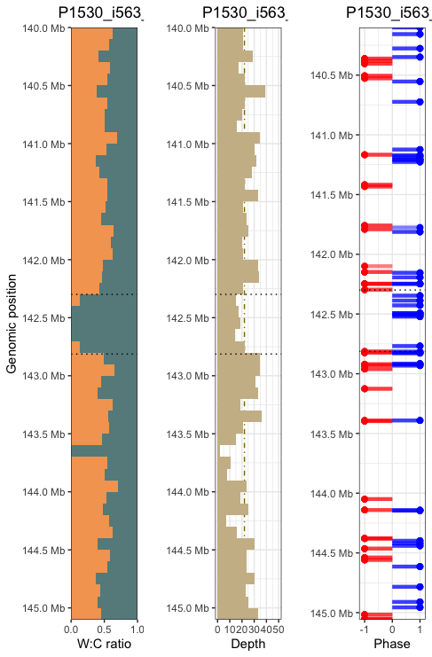

# Strand-seq Channel plots
R functions for combinatorial data channel plotting of scTRIP single cell Strand-seq data.

# Roadmap

# 📕 Technical features
- [ x] Make yaml file for conda env to launch into RStudio server on the cluster
- [ ] Option to split H1 and H2 in seperate plots
- [ ] Option to plot sv call track along the plotting region
- [ ] General option to chose combination of channel plots through simple numeric ID (e.g. 3=classical trichannel, 4= same but split haps etc.)
- [ ] Region of interest highlighting
- [ ] Add Counts channel
- [ ] loop through all cells of samples for given ranges for manual curation of hotspots

# 🛑 Small issues

- [ ] Scaling
- [ ] Pretty breaks scaling of Haps not responsive yet
- [ ] subsetting is slow
- [ ] parallelization for haplotagger

Example output plot:

# 💂‍♂️ Authors
- [Patrick Weidner](https://github.com/pweidner)
- [Suharto Bannerjee](https://github.com/suhartobanerjee)

Please contact us with any problems or submit them as an issue in this Github repository.
