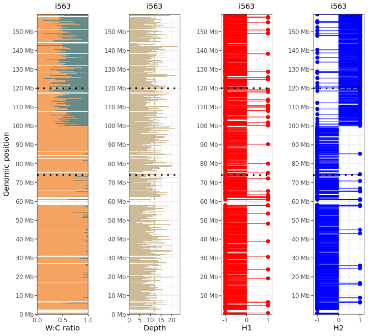

# Strand-seq Channel plots
R functions for combinatorial data channel plotting of scTRIP single cell Strand-seq data.

# Usage
1. Clone the repository

```bash
git clone https://github.com/pweidner/tri-channel-plots
```
2. Launch plot_channels function from run_script.R

Input files:
- d <- scTRIP counts output file (e.g. AGLCD.txt.gz)
- d.hap <- run haplotagger on bam files in the haplotag folder or import such table

Function Parameters:
- cell_ID (e.g. "i504")
- chromosome (e.g. "chr2")
- channels (e.g. 1-4)
- plot_range (e.g. c(40000000,120000000))
- roi (e.g. c(7500000,85000000)

# Roadmap

# 📕 Technical features
- [X] Make yaml file for conda env to launch into RStudio server on the cluster
- [X] Option to split H1 and H2 in seperate plots
- [ ] Option to plot sv call track along the plotting region
- [X] General option to chose combination of channel plots through numeric ID (e.g. 3=classical trichannel, 4= same but split haps etc.)
- [ ] Update ggarrange composition based on channels ID after including merged haps
- [X] Region of interest highlighting
- [ ] Add Counts channel (hisogram plot)
- [ ] loop through all cells of samples for given ranges for manual curation of hotspots (sample param)

# 🛑 Small issues

- [ ] Scaling
- [X] Input parameter checks especially for channels beeing either 1,2,3 or 4 for now!
- [ ] Formatting of breaks in smaller regions (scale_mb function)
- [X] subsetting is slow
- [ ] parallelization for haplotagger

Example output plot:



# Authors
- [Patrick Weidner](https://github.com/pweidner)
- [Suharto Bannerjee](https://github.com/suhartobanerjee)
- David Porubsky wrote some of the functions were sourcing here, thanks!

Please contact us with any problems or submit them as an issue in this Github repository.
